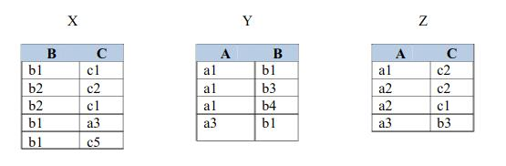
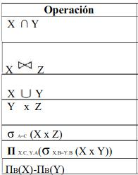
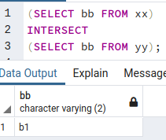
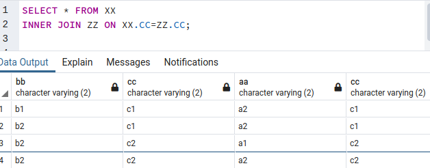
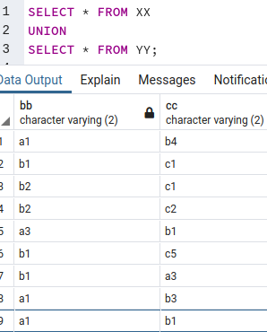
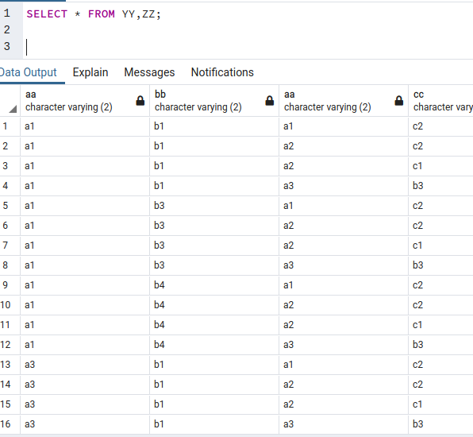
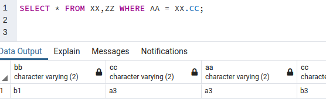
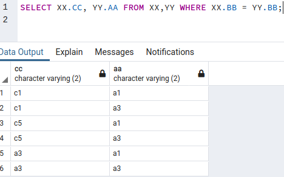
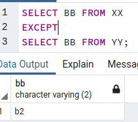
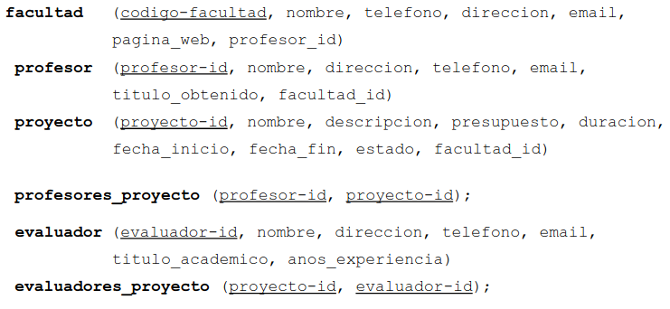

# LABORATORIO PRACTICO 2
* Description
*this is a practical laboratory from the  Databases course*

##PUNTO 1 ##

* Dadas las relaciones X, Y y Z, completar la tabla 1. Partiendo de la operación del algebra relacional que se muestra la primera columna, escriba una instrucciónSQL adecuada para cada operación. En la última columna escriba el resultado que se obtiene al aplicar dicha consulta. Escriba este resultado lo más claramente posible, use tablas si es necesario.\


**Solucion**
* consulta 1\

* consulta 2\

* consulta 3\

* consulta 4\

* consulta 5\

* consulta 6\

* consulta 7\



##PUNTO 2 ##



* 2.1 CREACION DE LA BASE DE DATOS
``` laboratorio2.sql

create domain name_r as varchar(50) not null;
create domain phone_r as varchar(30) default '0';
create domain email_r as varchar(40) not null;

-- facultad (codigo_facultad, nombre, telefono, direccion, email, pagina_web, profesor_id)

drop table if exists facultad;
create table facultad (
    codigo_facultad varchar(20),
    nombre name_r,
    telefono phone_r,
    direccion varchar(30),
    email email_r unique,
    pagina_web varchar(50),
    profesor_id varchar(20) unique
);

-- profesor (profesor_id, nombre, direccion, telefono, email, titulo_obtenido, facultad_id)

drop table if exists profesor;
create table profesor (
    profesor_id varchar(20),
    nombre name_r,
    direccion varchar(50),
    telefono phone_r,
    email email_r unique,
    titulo_obtenido varchar(30),
    facultad_id varchar(20)
);

-- proyecto (proyecto_id, nombre, descripcion, presupuesto, duracion, fecha_inicio, fecha_fin, estado, facultad_id)

drop table if exists proyecto;
create table proyecto (
    proyecto_id varchar(20),
    nombre text not null unique,
    descripcion text not null,
    presupuesto int default 0,
    duracion varchar(20) default 'Por definir',
    fecha_inicio date not null,
    fecha_fin date not null,
    estado varchar(20) default 'En espera',
    facultad_id varchar(20)
);

-- profesores_proyecto (profesor-id, proyecto-id)

drop table if exists profesores_proyecto;
create table profesores_proyecto (
    profesor_id varchar(20),
    proyecto_id varchar(20),
    primary key (profesor_id, proyecto_id)
);

-- evaluador (evaluador_id, nombre, direccion, telefono, email, titulo_academico, anos_experiencia)

drop table if exists evaluador
create table evaluador (
    evaluador_id varchar(20),
    nombre name_r,
    direccion varchar(30),
    telefono phone_r,
    email email_r unique,
    titulo_academico varchar(30),
    anos_experiencia int default(0) check ( anos_experiencia <= 80 )
);

-- evaluadores_proyecto (proyecto-id, evaluador-id)

drop table if exists evaluadores_proyecto;
create table evaluadores_proyecto (
    proyecto_id varchar(20),
    evaluador_id varchar(20),
    primary key (proyecto_id, evaluador_id)
);

-- Primary key of facultad
alter table facultad
    add constraint facultad_pk primary key (codigo_facultad);
-- Primary key of Profesor
alter table profesor
    add constraint profesor_pk primary key (profesor_id);
-- Primary key of proyecto
alter table proyecto
    add constraint proyecto_pk primary key (proyecto_id);
-- Primary key of evaluador
alter table evaluador
    add constraint evaluador_pk primary key (evaluador_id);

-- Foreign key of facultad
alter table facultad
    add constraint facultad_fk foreign key (profesor_id) references profesor(profesor_id);

-- Foreign key of profesor
alter table profesor
    add constraint profesor_fk foreign key (facultad_id) references facultad(codigo_facultad);

-- Foreign key of proyecto
alter table proyecto
    add constraint proyecto_fk foreign key (facultad_id) references facultad(codigo_facultad);

-- Foreign keys of profesores_proyecto
alter table profesores_proyecto
    add foreign key (profesor_id) references profesor(profesor_id),
    add foreign key (proyecto_id) references proyecto(proyecto_id);

-- Foreign keys of evaluadores_proyecto
alter table evaluadores_proyecto
    add foreign key (proyecto_id) references proyecto(proyecto_id),
    add foreign key (evaluador_id) references evaluador(evaluador_id);

 ```
